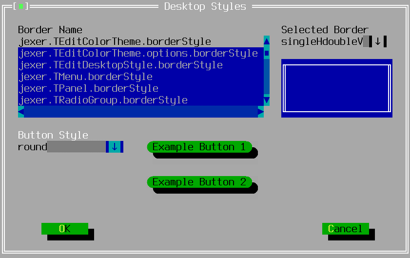

TEditDesktopStyleWindow
=======================

TEditDesktopStyleWindow provides a dialog window for users to alter
the running border styles and button style.  The OK button saves
changes to the color theme; the Cancel button aborts changes.


Screenshots
-----------

{width=841 height=529}

Examples
--------

```Java
new TEditDesktopStyleWindow(getApplication());
```

API
---

[TEditDesktopStyleWindow API](/TEditDesktopStyleWindow.html)
