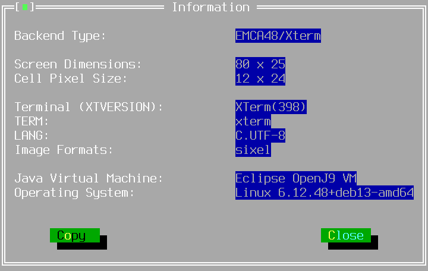
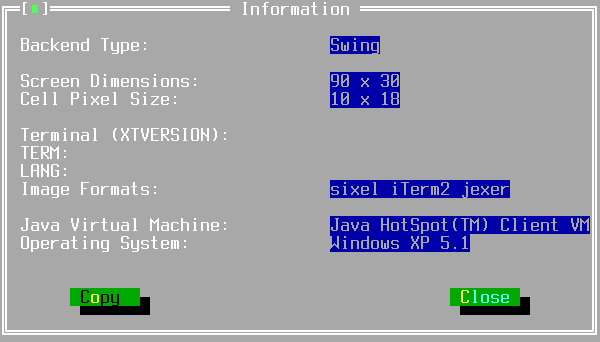

TTerminalInformationWindow
==========================

TTerminalInformationWindow provides a dialog window for reporting
information about the display/terminal and running JVM.

Screenshots
-----------

{width=720 height=456}

{width=600 height=342}

Examples
--------

```Java
new TTerminalInformationWindow(getApplication());
```

API
---

[TTerminalInformationWindow API](/TTerminalInformationWindow.html)
